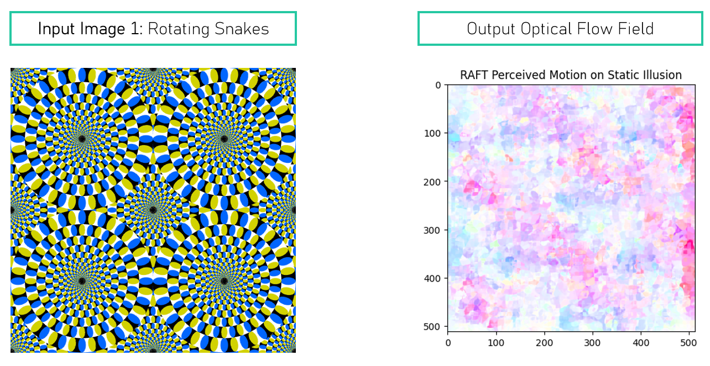
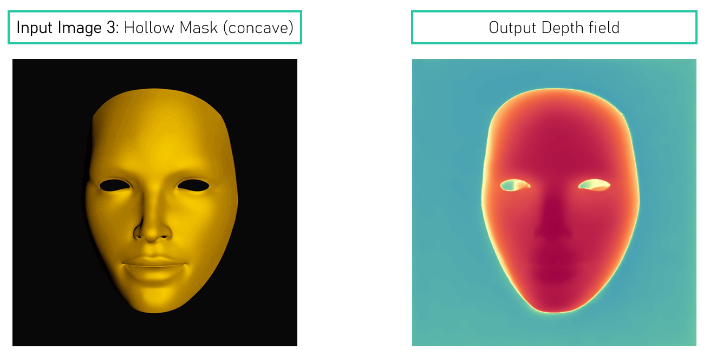
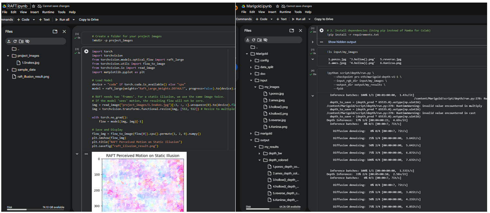
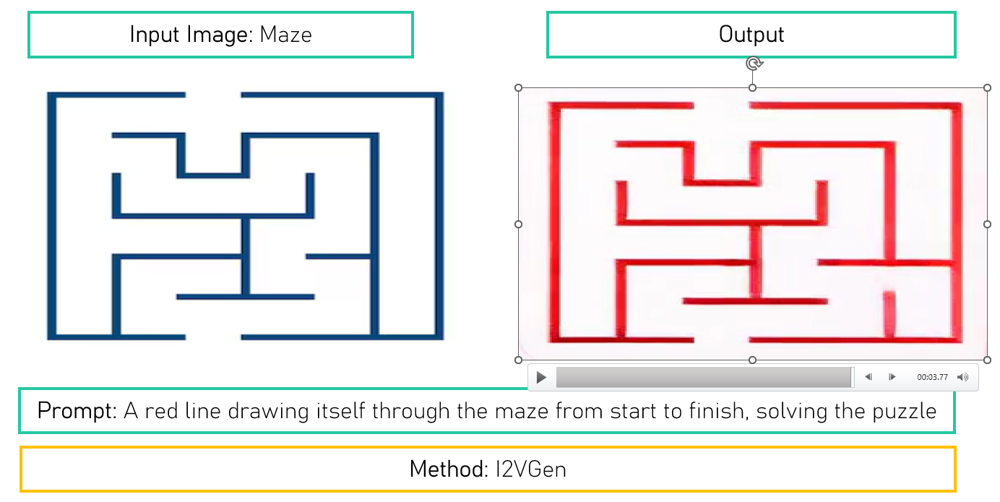
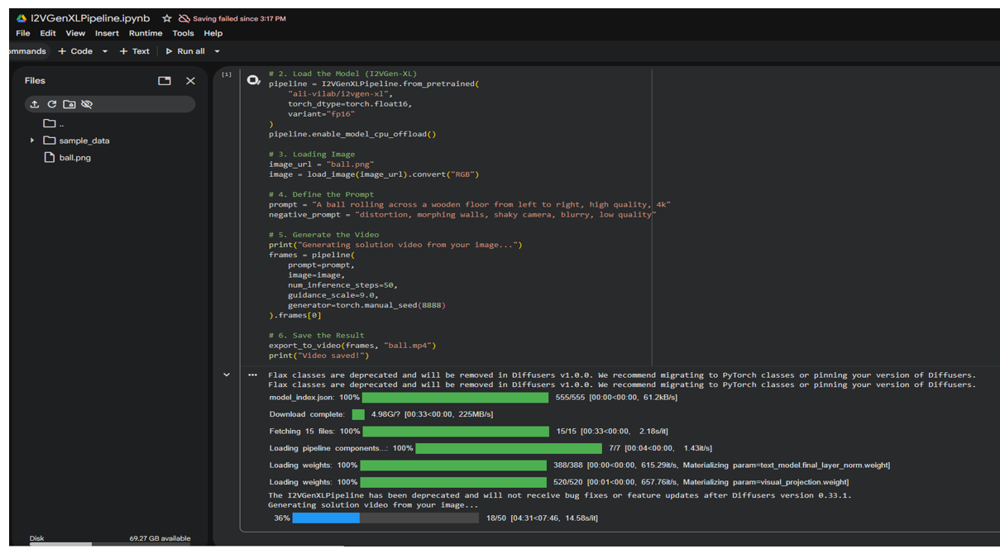

# Computational Visual Perception - Course Projects

Projects from Prof. Bernhard Egger's **Computational Visual Perception** course (Winter 2025/26) at Friedrich-Alexander-Universität (FAU) Erlangen-Nürnberg. 

This repository explores the intersection of state-of-the-art Generative AI, Computer Vision, and biological plausibility, evaluating how well modern models actually "solve" human vision and physical reasoning.

## Course Info
- **Instructor:** Prof. Bernhard Egger
- **Institution:** FAU Erlangen-Nürnberg
- **Semester:** Winter 2025/26
- **Result:** Recommended Solution 
---

## Part 1: Zero-Shot Video Generation Evaluation
Evaluated **Veo 3.1 vs. Veo 2.0** across multiple zero-shot vision tasks including blind deblurring, edge detection, and novel view synthesis. 
* **Key Finding:** Demonstrated Veo 3.1's superior spatial instruction-following capabilities. Older models like Veo 2.0 rely heavily on LLM prompt rewriting; disabling it resulted in severe performance drops, proving the necessity of language priors for visual fidelity.
* **Tech:** Python, PyTorch, Google Veo API

*Caption: Comparative evaluation of Veo 3.1 vs 2.0 on zero-shot visual tasks.*

---

## Part 2: Optical Flow & Depth Estimation on Visual Illusions
Investigated how standard computer vision models react to static motion illusions and depth paradigms compared to the human cortex.
* **Optical Flow (RAFT):** Investigated RAFT's failure to perceive motion in static illusions (Rotating Snakes, Ouchi patterns). Revealed RAFT outputs weak, locally inconsistent vectors driven by texture contrast, lacking the temporal prediction mechanisms present in the human V5/MT+ cortex.
* **Depth Estimation (Marigold):** Evaluated Marigold on perceptual illusions (Ames Room, Hollow Mask). Found Marigold successfully mimics human depth biases, relying on learned perceptual priors (perspective, shading, object regularity).
* **Tech:** Python, PyTorch, RAFT, Marigold, Diffusion Models

*Caption: RAFT optical flow extraction on the Rotating Snakes illusion, showing fragmented texture-based flow rather than unified illusory motion.*

*Caption: Marigold depth estimation successfully replicating human perspective biases.*

*Caption: Terminal interface for RAFT and Marigold executions.*

---

## Part 3: Evaluating Zero-Shot Physics & Reasoning in Video Models
Tested open-source diffusion models (**I2VGen, Wan2.1**) to see if they can simulate logical planning (solving a maze) and physical consistency (momentum of a rolling ball). 
* **Methodology:** Implemented an automated Color-Based Object Tracker using **OpenCV** (HSV color space masking, centroid tracking) to quantitatively extract object trajectories frame-by-frame.
* **Key Finding:** Extracted data proves these models fail to encode fundamental physical laws (inertia, spatial object permanence). They act as "probabilistic texture morphers" rather than world simulators, hallucinating paths and losing momentum.
* **Tech:** Python, OpenCV, HuggingFace Diffusers, I2VGen, Wan2.1

*Caption: HSV-based centroid tracking via OpenCV to extract temporal trajectories of generated video subjects.*

*Caption: Automated video generation pipeline via terminal interface.*
